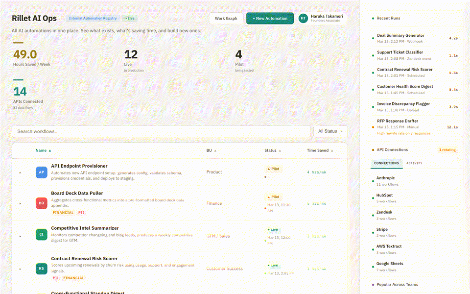

# Rillet AI Ops

**An AI operations control plane** — the missing layer between automation tools and leadership.

> AI adoption creates operational chaos before it creates efficiency. Companies need a system to manage AI work across teams — not another workflow builder, but a registry that answers: what exists, who owns it, does it work, and should we build something new?

## Live Demo

**[→ Open the demo](https://shiki4709.github.io/rillet-ai-registry/)**



## What You'll See

**The Registry** — 16 AI workflows running across 6 teams. Each shows: time saved, status (Live/Pilot), last run, business impact level, and data sensitivity tags (PII/Financial).

**Workflow Detail** — Expand any row to see: how it works (plain English), the block pipeline, guardrails (rules the AI must follow every run), version history, reliability, and who else reuses it.

**New Automation (chat)** — Full-screen AI advisor. Describe what you do manually → it checks if a workflow already exists (split-view preview) → classifies the work lane (Product/Product Ops/Ops) → generates a build spec with blocks, credentials, and auto-suggested guardrails.

**Work Graph** — Which workflows have the highest business impact. Which APIs carry the most dependency risk. Which teams automate the most. The operational map no org chart can show.

**API Connections** — Click any API name to see: key status, workflows using it, recent activity, and team comments.

**Block Intelligence** — Click any block in a pipeline to see: what it does at Rillet specifically, when to use it vs alternatives, what insights you can extract, and pros/cons.

## Core Object Model

```
Workflow → has many Blocks → each uses an API
         → has many Guardrails (standing rules)
         → belongs to a Business Unit
         → has an Owner
         → has many Runs
         → tracks Prompt Versions
         → has Business Impact level
```

## The Bigger Idea: AI Work Graph

Each workflow defines a work path. Hundreds of workflows become a structured map of how the company operates — where AI touches the business, where work is still manual, and what should be automated next.

| Stage | What it does | Status |
|-------|-------------|--------|
| Registry | Catalog all AI automations | Built |
| Governance | Track reliability, ownership, credentials, guardrails | Built |
| Discovery | Find reuse, match existing workflows | Built |
| Work Graph | Map how work flows across the company | Built |
| Optimization | Recommend automations automatically | Future |

## Tech

Single HTML file. No build step. No backend. Loads `data/registry.json` at runtime (falls back to inline data for `file://` protocol). Deployed via GitHub Pages.

## Files

- `index.html` — the entire UI
- `data/registry.json` — workflow data (source of truth)
- `PRD.md` — full product requirements document
- `CLAUDE.md` — system instructions

## Deploy

1. Fork this repo
2. Settings → Pages → Source: Deploy from branch → main → / (root) → Save
3. Live at `https://[username].github.io/rillet-ai-registry/`
